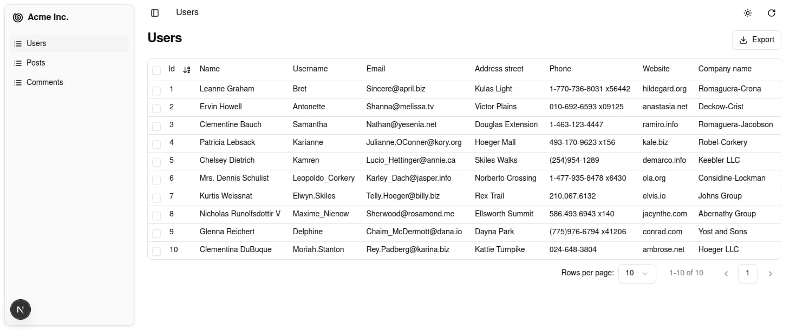

# Using Shadcn Admin Kit with Next.js

Shadcn Admin Kit runs seamlessly on Next.js, and requires minimal configuration.

## Create a New Next.js Project

The first step is to create a new Next.js project using the `create-next-app` command.

```bash
npx create-next-app@latest
```

A prompt will asks you some questions, it is important that you answer:

- `Yes` to `Would you like to use TypeScript?`
- `Yes` to `Would you like to use Tailwind CSS?`
- `No` to ` Would you like your code inside a ``src/`` directory? `
- `Yes` to ` Would you like to customize the import alias (``@/*`` by default) `
- `@/*` to `What import alias would you like configured?`

Feel free to choose answers according to your needs for the other quetions. As for the App Router, this tutorial assumes that you are using it.

```bash
npx create-next-app@latest
Need to install the following packages:
create-next-app@15.3.3
Ok to proceed? (y) y

✔ What is your project named? … shadcn-admin-next
✔ Would you like to use TypeScript? Yes
✔ Would you like to use ESLint? Yes
✔ Would you like to use Tailwind CSS? Yes
✔ Would you like your code inside a `src/` directory? No
✔ Would you like to use App Router? (recommended) Yes
✔ Would you like to use Turbopack for `next dev`? Yes
✔ Would you like to customize the import alias (`@/*` by default)? Yes
✔ What import alias would you like configured? … @/*
```

## Configure Typescript

Once the new project has been created, we have to update the `tsconfig.app.json` as described in this repository's [`README.md`](../README.md).

```json
{
  "compilerOptions": {
    // ...
    "verbatimModuleSyntax": false
  }
}
```

## Install Shadcn Admin Kit Components

Once our project has been initialized, we can pull the `shadcn-admin-kit` components using the `shadcn` command:

```bash
npx shadcn@latest add https://marmelab.com/shadcn-admin-kit/r/shadcn-admin-kit-base.json
```

This will create install the `Shadcn Admin Kit` inside the `components/admin` directory, and utilities inside the `hooks` and `lib` directories.

## Configure the Admin App

The `<Admin>` component (`components/admin/admin.tsx`) requires a **dataProvider** to communicate with you API. We'll use a third-party package, `ra-data-json-server` to map the [JSONPlaceholder](https://jsonplaceholder.typicode.com/) API to the admin CRUD API. There are [dozens of data provider packages](./DataProviderList.md) for various APIs and databases. You can also create your own if necessary. For now, let's make sure the app connects to JSONPlaceholder. To install the JSONPlaceholder dataprovider, you can run the following command:

```sh
npm install ra-data-json-server
```

First, we will create the `app/admin/AdminApp.tsx` file that will contain our admin app. We will leverage the `ListGuesser` and `EditGuesser` components provided by `Shadcn Admin Kit` in our three resources.

```tsx
// app/admin/AdminApp.tsx
"use client";

import { Admin, EditGuesser, ListGuesser } from "@/components/admin";
import { Resource } from "ra-core";
import jsonServerProvider from "ra-data-json-server";

const dataProvider = jsonServerProvider("https://jsonplaceholder.typicode.com");

const AdminApp = () => (
  <Admin dataProvider={dataProvider}>
    <Resource
      name="users"
      list={ListGuesser}
      edit={EditGuesser}
      recordRepresentation="name"
    />
    <Resource
      name="posts"
      list={ListGuesser}
      edit={EditGuesser}
      recordRepresentation="title"
    />
    <Resource name="comments" list={ListGuesser} edit={EditGuesser} />
  </Admin>
);

export default AdminApp;

```

**Tip:** You can use the  [`recordrepresentation`](https://marmelab.com/react-admin/Resource.html#recordrepresentation) with resources to configure how the record will be rendered by Shadcn Admin Kit.

## Create the Admin Page

Once the <AdminApp /> has been configured, we can create the admin page at `app/admin/page.tsx` to dynamically import our admin component and render it with SSR disabled (since it's a SPA).

```tsx
// app/admin/page.tsx
"use client";

import dynamic from "next/dynamic";

const Admin = dynamic(() => import("./AdminApp"), {
  ssr: false, // Required to avoid react-router related errors
});

export default function Page() {
  return <Admin />;
}

```

Then, run `npm run dev` and go to `http://localhost:3000/admin` to access your admin app!


